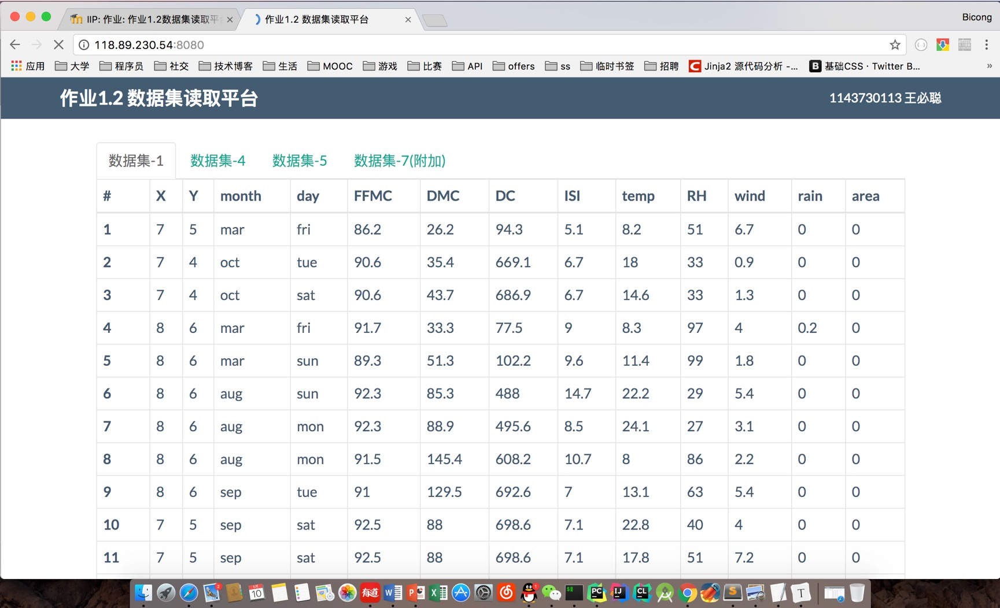
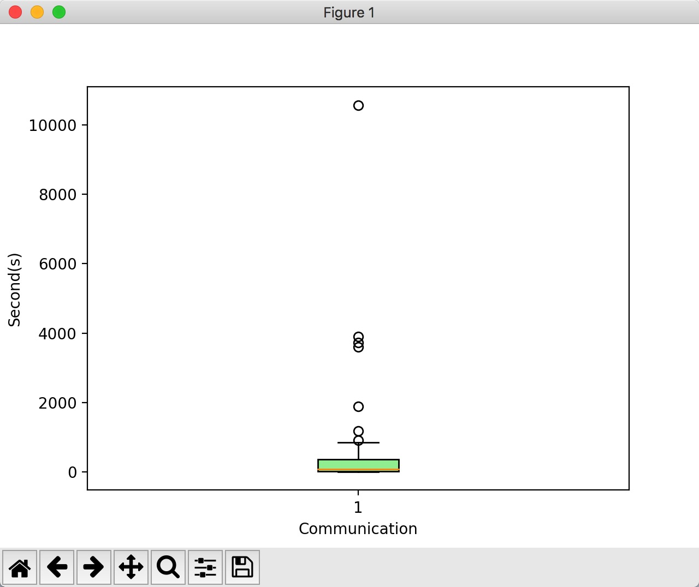
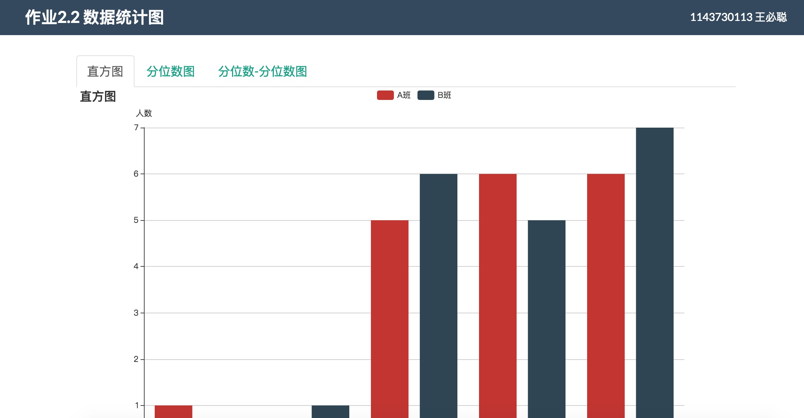
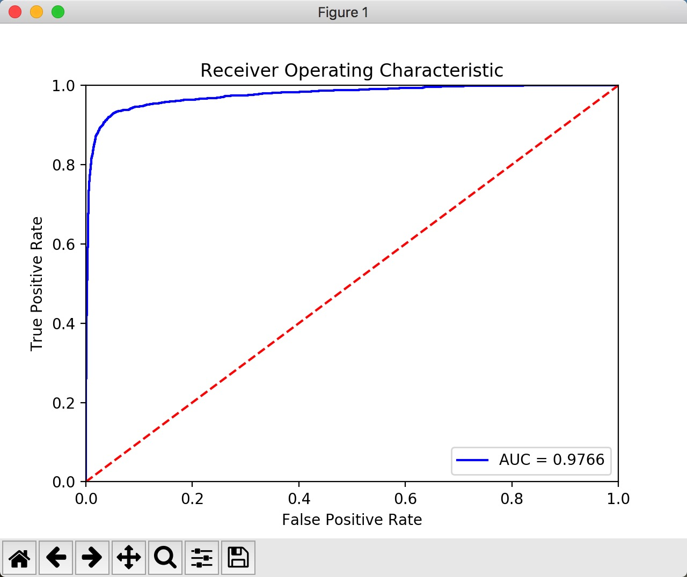
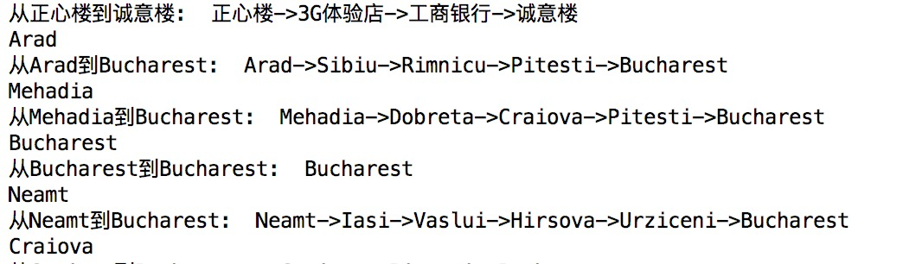

# 物联网智能信息处理

## 作业1.1 通话记录数据收集

中国移动目前不支持csv格式导出，于是写了一个小脚本负责解析目标html字符串。      
`main.py`中使用简单的正则表达式对html中表格数据进行提取，如果未来中国移动的格式发生改变，你也可以仿照该文件重新写一个处理脚本。

## 作业1.2 数据集读取平台

## 作业2.1 通话时长盒图可视化

## 作业2.2 绘制数据属性的统计图形

## 作业2.3 实现数据的预处理

空

## 作业3.1 感知机与最近中心分类器

使用`sklearn`框架进行两个分类模型的训练与预测，使用`matplotlib`框架进行图形化绘制。

## 作业3.2 多层感知机分类器

同上

## 作业3.3 卷积神经网络

使用`Tensorflow`框架进行Softmax回归和卷积神经网络的训练。

## 作业4.2 实现A*搜索算法

